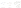
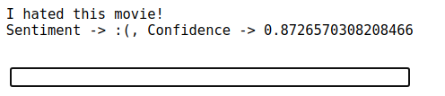

The goal of this project is to build a deep learning model that is able to understand if a comment that was made is positive or negative.

The model consists of an Embedding Layer, then the RNN and finally with a fully connected layer that is responsible for the final classification, 1/0 positive or negative review. For the training and evaluation of the model was used the IMDB Movie Reviews dataset.


**Tokenizing Data** 

First we have to split the text into words in order to be able to construct the vocabulary.

```(['i', 'don', 't', 'know', 'why', 'i', 'like', 'this', 'movie', 'so', 'well', 'but', 'i', 'never', 'get', 'tired', 'of', 'watching', 'it'], 1)```

```(['this', 'is', 'the', 'definitive', 'movie', 'version', 'of', 'hamlet', 'branagh', 'cuts', 'nothing', 'but', 'there', 'are', 'no', 'wasted', 'moments'], 1) ```

```(['adrian', 'pasdar', 'is', 'excellent', 'is', 'this', 'film', 'he', 'makes', 'a', 'fascinating', 'woman'], 1) ```

```(['ming', 'the', 'merciless', 'does', 'a', 'little', 'bardwork', 'and', 'a', 'movie', 'most', 'foul'], 0) ```

```(['long', 'boring', 'blasphemous', 'never', 'have', 'i', 'been', 'so', 'glad', 'to', 'see', 'ending', 'credits', 'roll'], 0) ```

```(['this', 'movie', 'is', 'terrible', 'but', 'it', 'has', 'some', 'good', 'effects'], 0) ```

The 0/1 in the end indicates if a comment is positive or negative.

**Creating Vocabulary**

First, we find the most frequent words that were used for the reviews:
```
{'<eos>': 0,
 '<unk>': 1,
 'i': 2,
 'this': 3,
 'movie': 4,
 'is': 5,
 'but': 6,
 'a': 7,
 'so': 8,
 'never': 9,
 'of': 10,
 'it': 11,
 'the': 12,
 'don': 13,
 't': 14,
 'know': 15,
 'why': 16,
 'like': 17,
 'well': 18,
 'get': 19,
 'tired': 20,
 'watching': 21}
  ```
  with <eos> end of sequence symbol used for padding and <unk> are the unknown words in our vocabulary.


Then, we have to construct a vocabulary which maps each word to an integer. An exampe review with the mapped integers looks like this:
  
```{'data': tensor([ 3,  5, 12,  1,  4,  1, 10,  1,  1,  1,  1,  6,  1,  1,  1,  1,  1]), 'label': tensor(1.)}```
  
**Constructing Embeddings** 
  
Now, we want to be able to understand the semantic relations between words and to understand if an order of the words has no meaning at all. For this purpose we are going to construct an Embedding Layer.
  

  
Then, we defined the Text classifier whiches components we already mentioned above, and trained the model with our dataset. After tunning the hyperparameters we got the following result.

**Results:**
  
**81,23% Accuracy**
 
Furthermore, a small live demo was created just for fun:
 



**PyTorch** was used for the development of the model.
